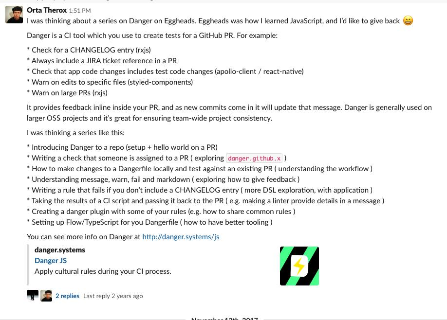

# Video Recordings Setup + Plan

## setup

- OBS
- Visual Studio Code
- Mac
- Thumbnails
- background Music
- video Edit tools
- intro/outro material
- Record process (video)
- Record process (audio)
- Recording Calendar
- twitch events calendar

## Content

- [ ] Videos Setup
- [ ] Gatsby 101
- [ ] DangerJS
- [ ] Live coding Devigner website
- [ ] Git OSS Workflow
- [ ] Performance improvements - CodeOp
- [ ] Gatsby
  - [ ] meat
  - [ ] theme development
- [ ] JS tips
  - [ ] refactor for loops to list operation (map)
  - [ ] currying
- [ ] React Tips
  - [ ] abstract components
- [ ] CSS Tricks
  - [ ] switch component styling with pseudo selectors
  - [ ] borders with shadows
  - [ ] setting width on elements
  - [ ] Sections separation benefits
- [ ] React Native Web
  - [ ] setup
  - [ ] accesibillity

### DangerJS

## Spreading the work

- export thumbnails for youtube
- export mini videos for twitter
